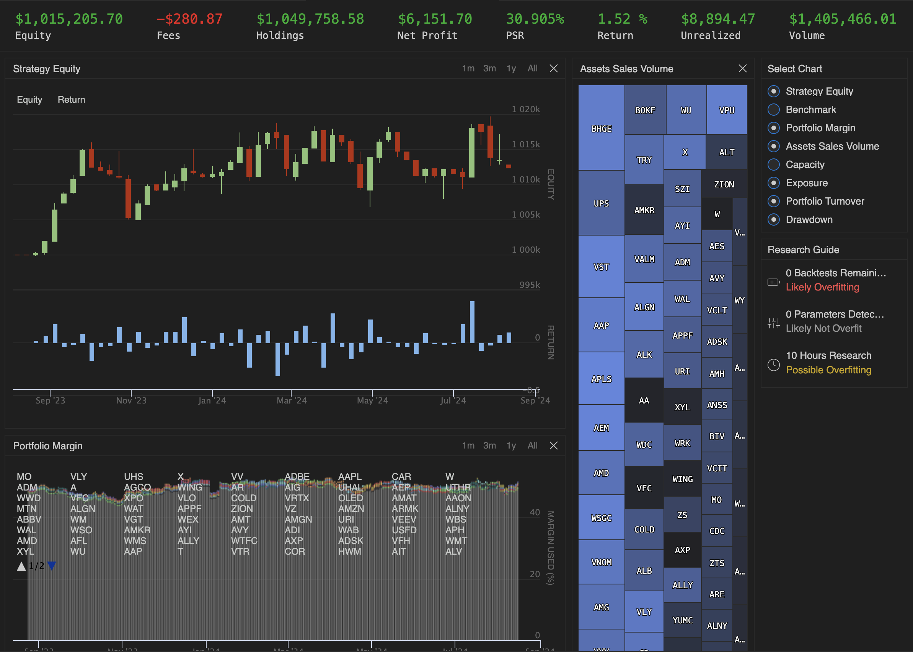
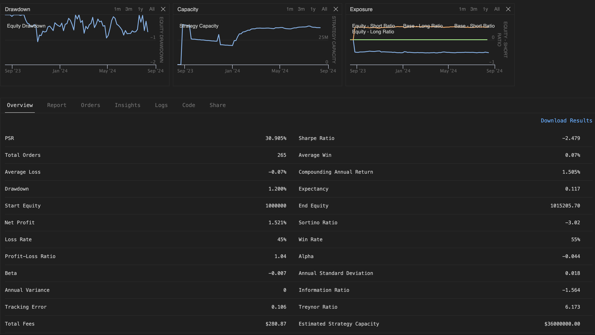

# XRL-Portfolio

eXplainable Reinforcement Learning for Portfolio Optimization project for the AMS 520 (Machine Learning in Quantitative Finance) course. 

The data used for this project was made available courtesy of Northfield data (proprietary data, not included in repository).

TODO:

- Model training:
    - Implement offline caching to minimize real-time computational demands during model training/evaluation.
    - Utilize GPUs
- Use a simultaneously trained GNN explainer to visualize policy updates (the original goal)
    - Requires GPUs
    - Possibly a more informative explanation of portfolio selection skill

The current state of results include:

**Figure 1**: Strategy equity plot (over the timespan of 1 year).            

**Figure 2**: Corresponding overview information for the selected portfolio (over the timespan of 1 year).   